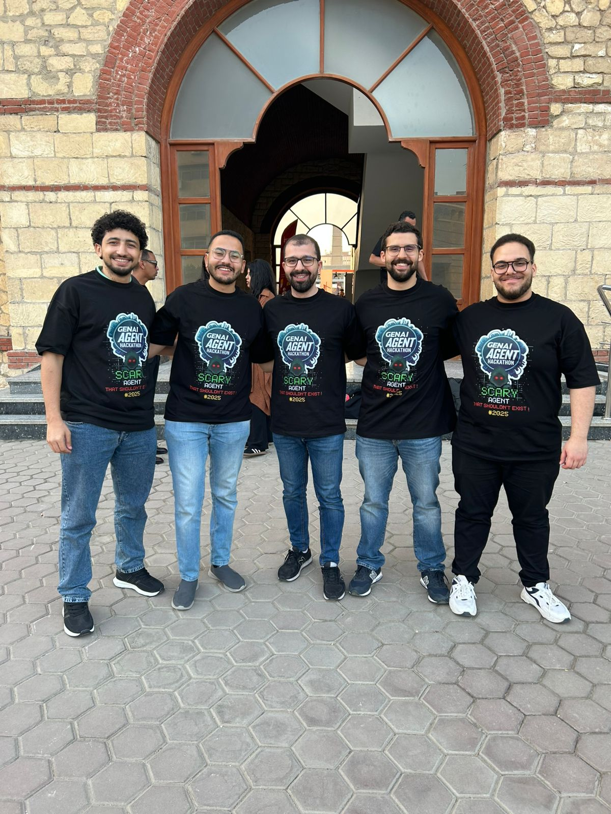

# MediSuite-Ai-Agent
A medical ai agent that helps automating the process of hospitals / insurance workflow 

`Update` We secured Runner-up award in [GenAi Agent Hackathon Cairo 2025](https://github.com/stakpak/genai-agent-hackathon-cairo-2025) organized  by [Stackpak](https://github.com/stakpak)
__________________________________________
## Features

### 1. Interactive Chat Interface
- Modern, user-friendly GUI with chat-like interface
- Real-time responses and suggestions
- Support for multiple interaction modes
- Toast notifications for important updates
- Status bar displaying current application state

### 2. Multiple Input Methods
- **Guided Mode**: Step-by-step assistance
- **Summary Mode**: Bulk information processing
- **Document Upload**: Support for PDF and image files
  - PDF document processing
  - Image (JPG, PNG) processing
  - OCR capabilities for text extraction

### 3. Medical Coding Support
- ICD-10 code lookup and suggestions
- CPT-4 code lookup and suggestions
- Fuzzy matching for accurate code recommendations
- Multiple code suggestions with confidence scores
- Code verification and confirmation

### 4. Patient Information Management
- Structured patient data collection
- Insurance information processing
- Data validation and verification
- Secure data handling

### 5. Document Generation
- CMS-1500 form generation
- PDF claim form creation
- Built-in PDF preview capability
- Support for multiple operating systems

### 6. Workflow Management
- Conversation state tracking
- Progress monitoring
- Error handling and recovery
- Session management

## Installation

1. Clone the repository:
```bash
git clone https://github.com/MahmoudRabea13/MediSuite-Ai-Agent.git
cd MediSuite-Ai-Agent
```

2. Install required dependencies:
```bash
pip install -r requirements.txt
```

3. Install system dependencies:
- Tesseract OCR ([Download](https://github.com/UB-Mannheim/tesseract/wiki))
- Poppler ([Download](https://blog.alivate.com.au/poppler-windows/))

4. Configure paths in `Agent.py`:
```python
pytesseract.pytesseract.tesseract_cmd = r'C:\Program Files\Tesseract-OCR\tesseract.exe'
POPPLER_PATH = r'C:\Program Files\poppler-24.08.0\Library\bin'
```

## Usage

1. Start the application:
```bash
python app.py
```

2. Choose your preferred interaction mode:
- Guided mode (step-by-step)
- Summary mode (all information at once)
- Document upload mode (PDF/JPG)

3. Follow the assistant's prompts to:
- Enter patient information
- Provide clinical notes
- Confirm suggested codes
- Generate and review claim forms

## Use Cases

1. **New Patient Coding**
   - Enter patient details
   - Input clinical notes
   - Review and confirm codes
   - Generate claim form

2. **Document Processing**
   - Upload medical documents
   - Extract information automatically
   - Verify and supplement data
   - Generate coded claims

3. **Code Lookup**
   - Search for specific ICD-10 codes
   - Look up CPT-4 procedures
   - Get code suggestions
   - Verify code accuracy

4. **Claim Generation**
   - Process patient information
   - Confirm diagnostic codes
   - Generate CMS-1500 forms
   - Preview and export claims

## Requirements

See [requirements.txt](requirements.txt) for full list of dependencies.

## Meet the Team

|  |
|--------------------|

<div align="center">

| [Mohamed Abdallah](https://github.com/mohamedabdallah20) | [Mahmoud Rabea](https://github.com/MahmoudRabea13) | [Mostafa Mansour](mailto:mostafa.mansour97@hotmail.com) | [Ahmed Mansour](https://github.com/ahmedmansour5) | [Ali Afifi](https://github.com/Ali-Afifi) |
|---------------------------------------------------------|---------------------------------------------------|---------------------------------------------------------|---------------------------------------------|---------------------------------------------|

</div>

## License

This project is licensed under the MIT License - see the [LICENSE](LICENSE) file for details.
